# 说明文档

## (一) 对话系统

### 1.数据生成

该dialogue system提供了数据生成的快捷脚本DialogueDataGenerate.cs

***【注】使用该脚本需要使用第三方库ExcelDataReader和ExcelDataReader.setdata***

该脚本的源码如下：

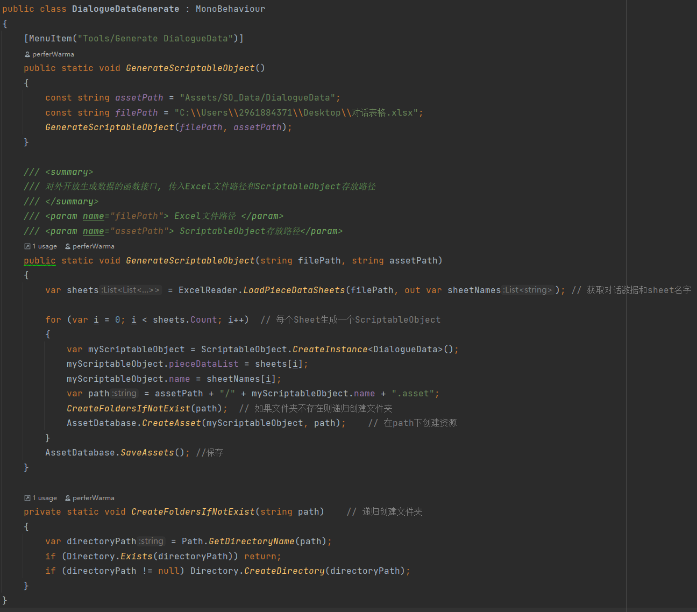

其中assetPath为数据的生成位置, filePath为要读取的Excel表数据

在确定你的生成路径和读取路径后，你可以在Unity中这样使用该生成方法：点击Tool下的“Generate DialougueData”选项即可


对话数据会以ScriptableObject的形式保存

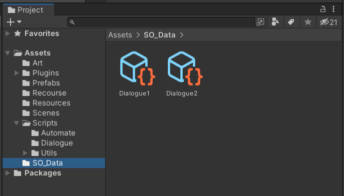

### 2.对话系统使用

对话系统的主要组成如下:

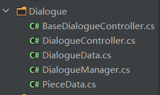

分别解释每一个脚本的作用：

### BaseDialogueController.cs

- 作为DialogueController的基类，为子类提供存放对话数据的属性接口和通过自身对话数据开启对话的方法接口

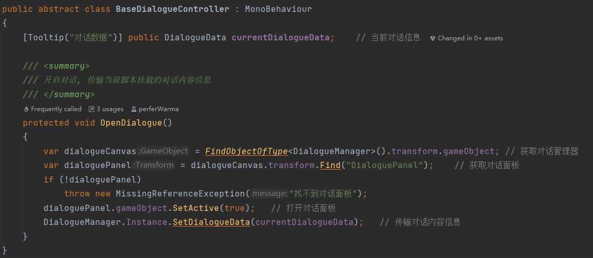

### DialogueController.cs

- 【使用方法】：将需要触发对话的GameObject挂载此脚本，设置好该对象对应的对话数据和触发方法即可，


上述例子中我们为GameObject挂载了该脚本，设置了该对象的对话数据，在介绍下面的脚本内容的时候我们会讲自定义触发条件

- 继承于BaseDialogueController，为挂载对象提供任意的触发对话的方法(需自己编写自定义触发条件)，下面是示例

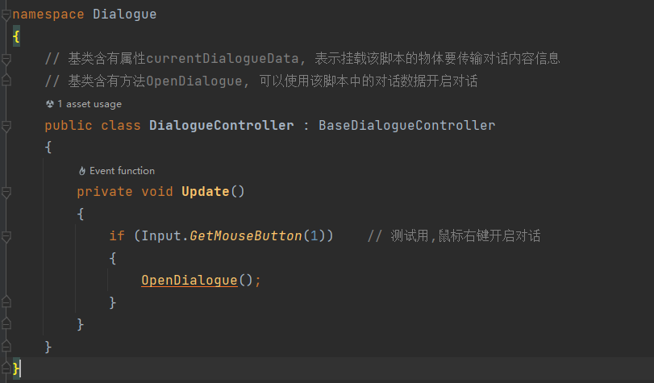

该例中，我们在按下鼠标右键的时候即可开启对话

**【注意！！！】**对于触发条件不同的物体，你有两种办法：

- 新建多个不同的脚本分别挂载，只要它是继承于BaseDialogueController即可，每个脚本单独设置它的触发方法（简单快捷，但是会导致脚本数增加）
- 统一使用相同的DialogueController脚本，在此脚本中通过Tag或者name来区分不同的物体，使其单独触发，下面给出示例（详细注释，不多赘述）

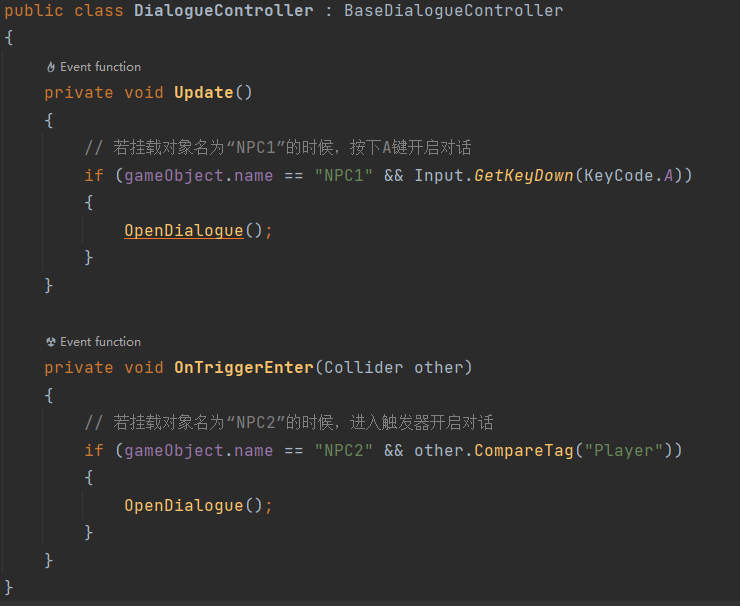

### DialogueData.cs

- 该脚本表示对话数据，继承于ScriptableObject，第一步中生成的数据类型即为此类，类里包含该对话数据的对话列表


### DialogueManager.cs

- 该系统的管理者，该对话系统的核心脚本，采用单例模式，控制对话的显示，隐藏，更新
- 提供各种组件的接口，详细注释，在此不多赘述


篇幅有限，每个方法的具体实现不予说明，可以查看源码，含有详细注释，下面给出测试用的挂载信息

【注】对话信息这一栏无需填写，DialogueController会自动为它赋值的

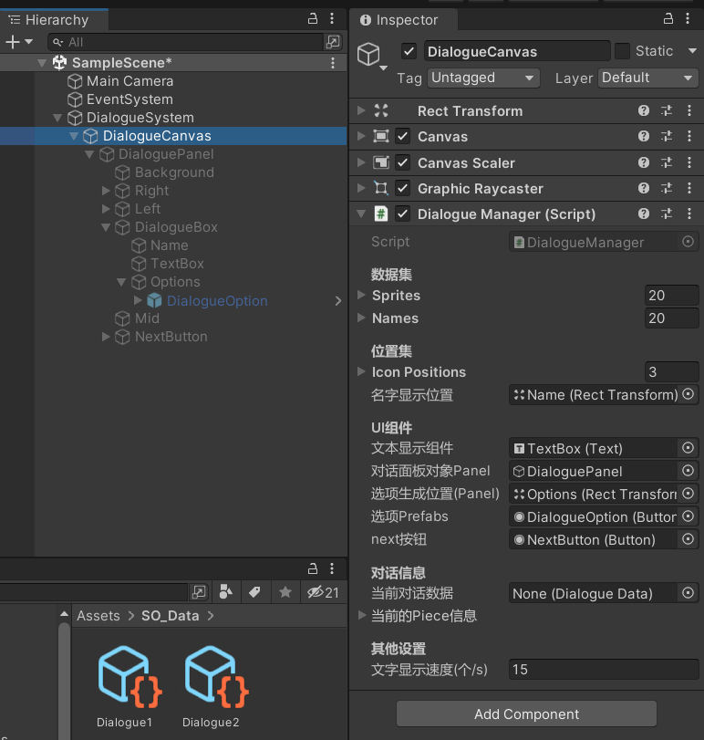

### PieceData.cs

- 单条对话数据，成员变量和Excel表的每一列一一对应

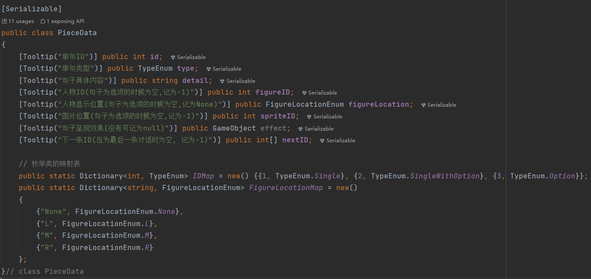


## (二) 存档系统

### 1.存档模式接口

- ISaveable接口, 作为ISaveWithPlayerPrefabs和ISaveWithJson的基类接口

  ```C#
  public interface ISaveable { }
  ```

- ISaveWithPlayerPrefabs接口, 如果你希望使用Unity提供的PlayerPrefabs的来存档,使需要保存的数据继承这个接口即可

  ```C#
  public interface ISaveWithPlayerPrefs : ISaveable
  {
      string SAVE_KEY { get; }	// 保存的键
      void SaveWithPlayerPrefs();
      void LoadWithPlayerPrefs();
  }
  ```

  

- ISaveWithJson接口, 如果你希望使用Json文件来存档,使需要保存的数据继承这个接口即可

  ```C#
  public interface ISaveWithJson : ISaveable
  {
      string SAVE_FILE_NAME { get; }	// 存档文件名
      void SaveWithJson();
      void LoadWithJson();
  }
  ```

  

- 枚举类,用于标记保存方法

  ```C#
  public enum SaveType
  {
      PlayerPrefabs,
      Json
  }
  ```

### 2.存档系统使用

在SaveManager.cs中实现了对Object的泛型Save和Load方法,分别对应PlayerPrefabs和Json两种实现

- Use PLayerPrefabs

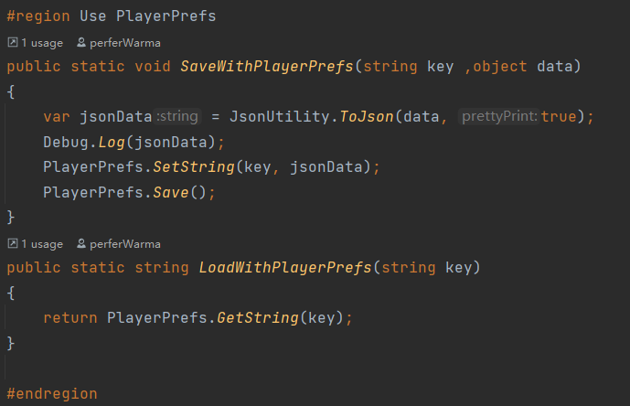

- Use Json

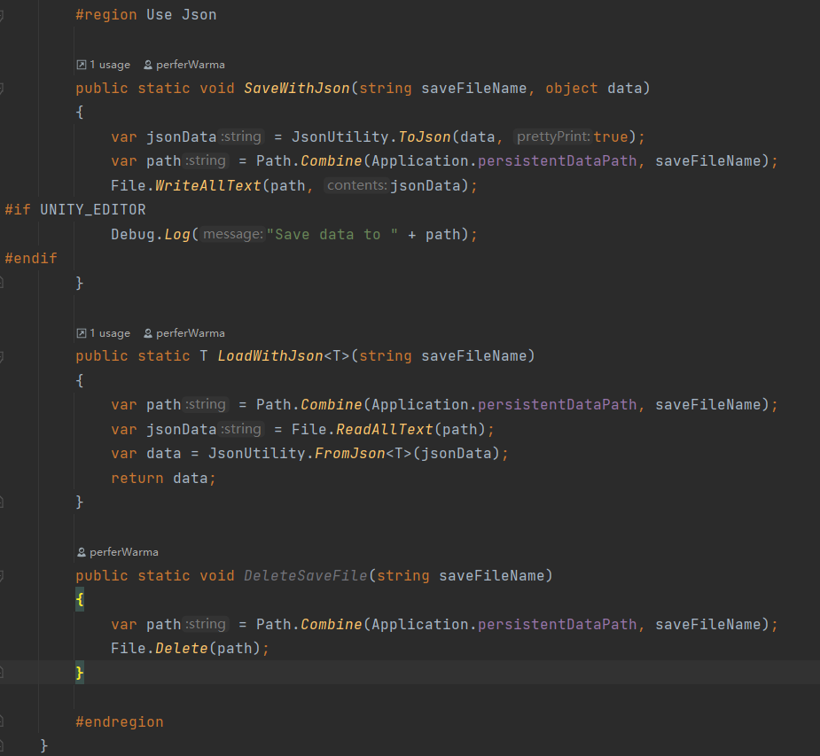

SaveManager设置为静态类,对于继承于上述接口的类,开放直接调用的Load和Save函数接口来保存数据

例如现有一个Player类继承于ISaveWithJson,可以直接这样来调用:

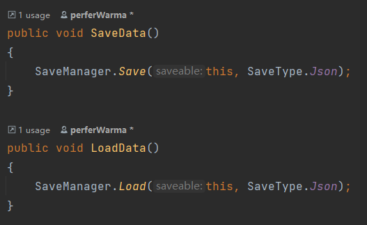


#### 具体使用案例

创建一个PlayerData类作为当前需要保存的信息类

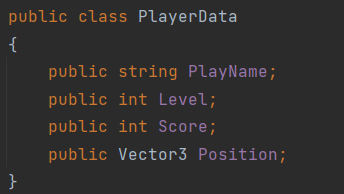

创建一个Player继承ISaveWithJson,ISaveWithPlayerPrefabs,实现对应的方法

- 当前类的属性


- 对应接口的实现方法,即设置需要保存和加载的信息, 使用SaveManager提供的函数接口来保存对应数据

  - ISaveWithPlayerPrefabs

  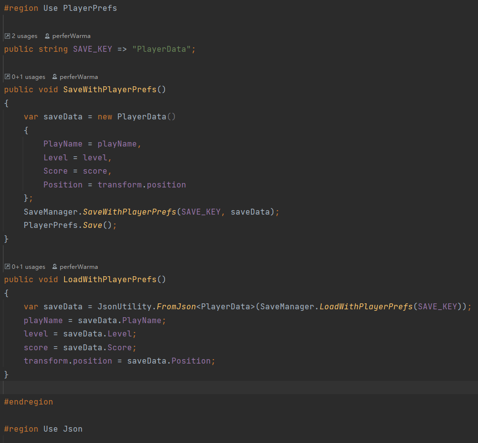

  - ISaveWithJson

  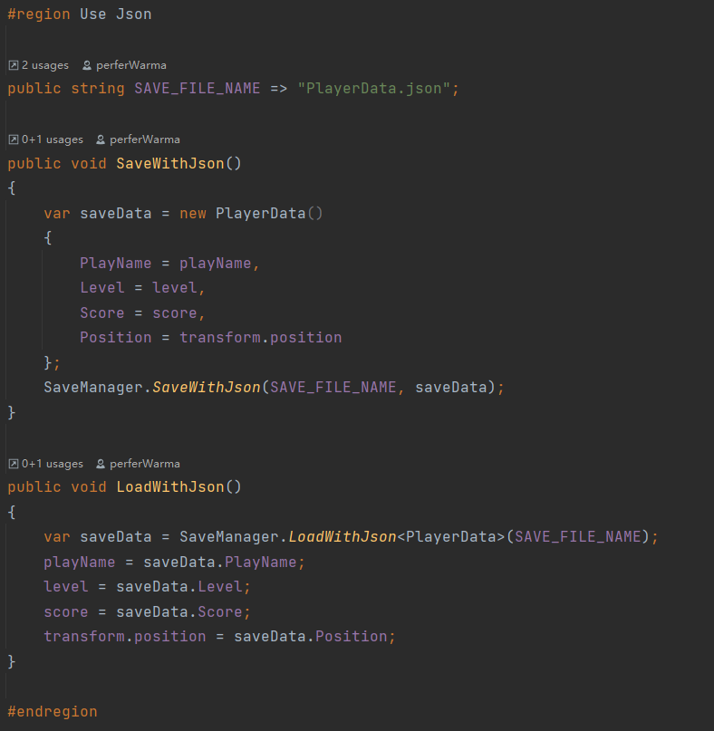

实现这些接口方法后即可使用SaveManager提供的Save和Load方法来一键保存和加载数据了

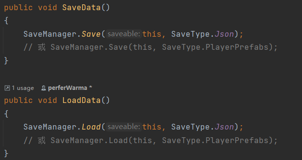


## (三) 单例系统

| 名称            | 类型      | 作用                                         |
| --------------- | --------- | -------------------------------------------- |
| ISingleton      | interface | 标识单例类                                   |
| Singleton       | class     | 泛型通用单例                                 |
| SceneSingleton  | class     | 场景内单例,继承MonoBehavior,切换场景后会销毁 |
| GlobalSingleton | class     | 全局单例,继承MonoBehavior,切换场景不会销毁   |

## (四) 对象池系统

1. 通用单例模式,无需挂载到GameObject上,使用ObjectPool.Instance来获取单例

2. 扩容方式为:初始化容量为10, 后续采用二倍扩容方式

3. 对外提供如下方法

   | 方法                                                         | 描述                                                         |
   | ------------------------------------------------------------ | ------------------------------------------------------------ |
   | GameObject **Allocate** (GameObject prefab)                  | 从对应的对象池拿出对象                                       |
   | void **Recycle** (GameObject prefab)                         | 将对象回收到对应的对象池中                                   |
   | void **ClearPool **(string prefabName, bool containActive = false) | 清空指定对象池中的对象, containActive为true时会销毁当前处于激活状态的对象 |
   | void **ClearAllPool** (bool containActive = false)           | 清空所有对象池中的对象,containActive为true时会销毁当前处于激活状态的对象 |

   

4. 在场景中创建的对象池系统层级结构如下: ParentPool为对象池父物体(自动生成), 为每类对象提供单独的对象池(自动创建),名为"${prefabs.name} + Pool"

   